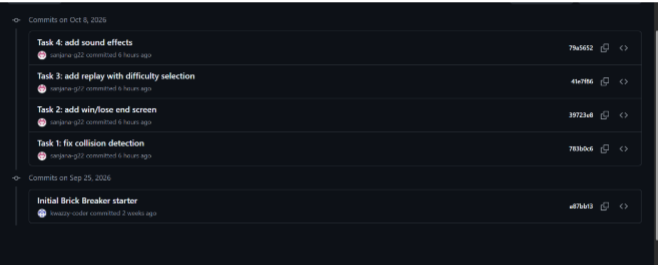

# SE Labs – PES1UG24CS420

Software Engineering lab deliverables.

**Name:** Sanjana
**SRN:** PES1UG24CS420

## Contents

| Lab | Folder | Deliverables |
|-----|--------|--------------|
| Lab 1 | [Lab1](./Lab1) | Requirements table, use-case flow and related diagrams |
| Lab 2 | [Lab2](./Lab2) | Jira backlog, sprints, burndown chart |
| Lab 3 | [Lab3](./Lab3) | Architecture diagram |
| Lab 4 | [Lab4](./Lab4) | VibeCoding: Brick Breaker (code, before/after videos, chat history) |

---

## Lab 4: VibeCoding (Brick Breaker)

**Objective:** Use an AI assistant (Claude) to fix a broken Pygame Brick Breaker game and add new features, using only four prompts, one per task.

### Bugs found
1. **Wrong collision bounce.** The ball always flipped its vertical direction on any hit, so side hits on bricks and the paddle bounced wrongly.
2. **Ball clipping and sticking.** The ball could stay inside a brick or the paddle and jitter, and could skip past neighboring bricks at speed.
3. **No end screen.** Winning or losing only printed to the console, and the game window just froze.
4. **No replay.** The game couldn't be restarted, and there was no difficulty choice.
5. **No sound.** The game had no audio feedback.

### Fixes and features
1. **Collision detection:** the bounce side is now worked out from the overlap, so side hits flip the horizontal direction and top/bottom hits flip the vertical one. The ball is pushed out after each hit, the paddle bounce angle depends on where the ball lands, and the ball moves in small steps so it can't skip bricks.
2. **Game over screen:** an in-window "YOU WIN!" or "GAME OVER" screen shows the final score and waits for a key press.
3. **Replay with difficulty:** after the end screen, press 1 (Easy), 2 (Medium) or 3 (Hard) to play again, with different ball speed and paddle width, or press Esc to quit. Everything resets on replay.
4. **Sound effects:** brick break, paddle hit, wall hit and win/lose sounds, all generated in code with no audio files, and the game still runs silently if audio isn't available.

All the code changes were made in `game/game_engine.py`.

### Deliverables (in [Lab4](./Lab4))
- Updated code: `main.py`, `game/`, `requirements.txt`
- Before video: [Before_Fixing_Bugs.mp4](./Lab4/Before_Fixing_Bugs.mp4)
- After video: [After_Fixing_Bugs.mp4](./Lab4/After_Fixing_Bugs.mp4)
- Chat history and links: [ChatHistory_Links.pdf](./Lab4/ChatHistory_Links.pdf)
- Videos on Drive: [Google Drive folder](https://drive.google.com/drive/folders/1IJeGpJX1gyKr6osM_WXCJDbyutD8yA3I?usp=sharing)
- Chat with Claude: [Shared chat link](https://claude.ai/share/04bc018e-1ab5-4b79-b8a0-29b244a9b954)

### Commit history

I made the changes in a **forked repo**, with a **separate commit for each task**:

**Fork:** [sanjana-g22/49_brick-breaker](https://github.com/sanjana-g22/49_brick-breaker) ([commits page](https://github.com/sanjana-g22/49_brick-breaker/commits/main))

| Task | Commit message |
|------|----------------|
| Task 1 | Task 1: fix collision detection |
| Task 2 | Task 2: add win/lose end screen |
| Task 3 | Task 3: add replay with difficulty selection |
| Task 4 | Task 4: add sound effects |

> **Note:** All four task commits were made individually in the forked repo above. When I copied the final code into this lab repo, I pushed it all at once, so the individual task commits don't appear in this repo's history.
